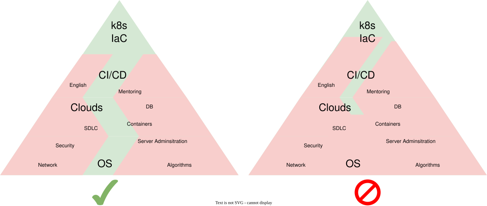
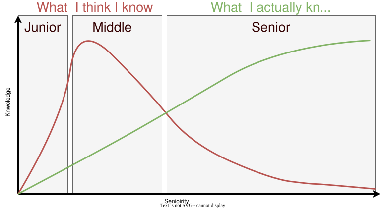

# GPT 4 IaC

*Date: 2025-02-12*

I've made some practical experiments with GPT in the IaC context and [gave a speech about that at the meetup](https://www.linkedin.com/feed/update/urn%3Ali%3Aactivity%3A7275537157463699458/) and [DevConf](https://pretalx.devconf.info/devconf-cz-2025/talk/R7VQXB/).

video: [www.youtube.com/watch?v=OMOVEMChr8A](https://www.youtube.com/watch?v=OMOVEMChr8A)

I'm using chatGPT like solutions in real life for different purpose:

- Read laws/documents and share the result.
- Write "official" letters in foreign languages (Spanish/Catalan).
- Translate words/abbreviations with multiple meanings.
- Analyze medical historical data and provide forecasts.

And I realized **🔥 it works well**. But what's about the IaC? is it usefull?

## Limitations

There are many solutions available publicly:

- [Phind](https://www.phind.com/)
- [Gemini](https://gemini.google.com/)
- [Perplexity](https://www.perplexity.ai/)
- [ChatGPT](https://chat.openai.com)
- [There's an AI for That](https://theresanaiforthat.com/)
- [GigaChat](https://gigachat.app/)
- [Claude](https://claude.ai/)
- [DeepL](https://www.deepl.com)

However, I've decided to limit myself to Copilot because it integrates smoothly with VSCode and is allowed for use. The main limitation is that **only public data is allowed**.

## Copilot 4 IaC: use cases

Let's take a look into real life examples and try to make some conclusions

### @ work: Documentations & presentations

**Goal:** Fluent, easy-to-read texts without mistakes.

**Pros:**

- Can rephrase and increase readability.
- Can propose reasonable grammar and syntax changes.
- Applicable for [presentations as code](https://www.goncharov.xyz/life/how-to-make-speech-en.html).

**Cons:**

- None identified

**Conclusion:** 🔥 it works well.

### @ work: create ansible lookup plugin

**Goal:** Transform the script `get-latest-version.py` to an Ansible lookup plugin. The purpose of the script was to:

- Connect to a Maven repository.
- Search for the artifact according to some rules.
- Print the artifact version.

**Pros:**

- Can generate the boilerplate but not ideal.
- Can propose reasonable syntax changes.

**Cons:**

- Suggested fixes can have wrong logic or indentation.

**Conclusion:** ✅ ok to use for well known domain area.

### @ work: generate documentation

**Goal:** Avoid boring tasks.

**Pros:**

- Can generate human-friendly, readable documentation.

**Cons:**

- Suggested fixes can have wrong logic or indentation.

**Conclusion:** ✅ it works well.

### @ work: explain jinja2 expressions

**Goal:** Understand written templates.

**Pros:**

- Explain step by step what's happening.

**Cons:**

- The context is required.

**Conclusion:** ✅ ok to use for well known domain area.

### @ work: debug Ansible OTC dynamic inventory plugin

**Goal:** Get list of VMs from OTC in Ansible friendly format.

**Pros:**

- Can generate suitable config.

**Cons:**

- Not enough knowledge about OTC and suggests non-existent parameters.
- Unable to identify the root cause of connection failures.
- **It is very easy to send secrets to third parties**.

**Conclusion:** ⛔️ fail.

### @ work: fix errors in Ansible roles

**Goal:** Fix errors during Java installation.

**Pros:**

- It proposed correct changes.

**Cons:**

- Some iterations are required.
- It doesn't know about infrastructure.

**Conclusion:** ❓ acceptable.

### @ work: explain dependencies across the project

**Goal:** Understand infrastructure dependencies across the different parts.

**Pros:**

- Not identified.

**Cons:**

- Doesn't know the entire project context.
- It doesn't support whole project as a context.

**Conclusion:** ⛔️ doesn't work.

### Copilot 4 IaC: use cases summary

Let's sum up:

- 🔥 Documentations & presentations
- ✅ Create Ansible lookup plugin
- ✅ Explain Jinja2 expressions
- ❓ Fix errors in Ansible roles
- ❓ Use agents to refactor ansible roles
- ❓ Debug Ansible OTC dynamic inventory plugin
- ⛔️ Explain dependencies across the project

| Pros                          |   | Cons                              |
|-------------------------------|---|-----------------------------------|
| Improves readability          |   | Lacks context                     |
| Proposes syntax changes       |   | Possible errors in suggestions    |
| Generates documentation       |   | Requires iterations               |
| Step-by-step explanations     |   | Limited knowledge                 |
| Generates configurations      |   | Unable to identify root causes    |

In other words we can re-phrase it like

- ✅ Solves small, well-decomposed tasks in known areas
- ✅ Improves documentation and presentation quality
- ❓ Fixes are possible, but require review and iterations

**Conclusion:** ❗️just imagine that there is very smart junior in your team.

## Ideas

In case of IaC I'm following [IDLC](https://www.goncharov.xyz/it/idlc-en.html)(SDLC for IaC) approach and I think it can be improved.

### 💡 Idea: PR reviewer

Make GPT as an optional reviewer in a repo:

1. Get the diff.
2. Load affected files as context.
3. Provide prompt: "review it".
4. Suggest changes to PR.

**Conclusion:** ❗️ [IDLC](idlc-en.md) can be improved.

### 💡 Idea: Increase IaC test coverage

There is [IaC testing pyramid](200k-iac-en.md) concept. It describes how to test IaC. The problem is that it's slow or just linting. The idea is that maybe it will be possible to add gpt to Static Analysis level. I.e. simulate an ansible or terraform execution without real execution. Maybe it will be faster or cheaper.

**Conclusion:** ❗️ [IaC testing](ansible-testing-en.md) can be improved.

### 💡 Idea: AI agents in incident management

- Should do incident management, but the cost of error might be too high
- Prepare that overview and save some time to meet SLA
- Generate post mortem from chats, logs, repos

**Conclusion:** 💡 AI prepare overviews & possible actions, but humans decide

## Copilot 4 learning

There is another way how to use it eg for learning to [become better DevOps](devops-roadmap.md)

### Copilot 4 learning: debugging

Systems are too complicated nowadays days. Troubleshooting itself is explaining the discrepancy between what you expect and what you observe. There are some standard approaches to troubleshoot:

- compare working & affected envs to detect the difference.
- rubber duck debugging works because the brain switch to another mode. Nowadays AI can be used instead of the duck
- did it work before?
- separate facts from assumptions. Use AI prompt: how to verify that …
- ask yourself and clients: what are you trying to achieve? Maybe you are fixing the wrong problem
- isolate/compensate the root cause

**Conclusion:** ✅ Can inspire new debugging directions

---

### Copilot 4 learning: root-cause analysis

Nowadays systems might be complicated and over engineered. AI can mislead you, it's your responsobility to navigate troubleshooting.

**Conclusion:**  ⛔️ Doesn’t replace system understanding

---

### Copilot 4 learning: feedback and reflection

There are 2 mindsets: expert & fixer. If you want to be better you should to dig into problems and find a root cause. You need to stay curious to learn new debug techniques and train your brain.

**Conclusion:** ⛔️ Without feedback and reflection, it's waste of tokens

---

### Copilot 4 learning: summary

- ✅ Can inspire new debugging directions
- ⛔️ Without feedback and reflection, it's waste of tokens
- ⛔️ Doesn’t replace system understanding or root-cause analysis

**Conclusion:** 🔥 Helps you enter a new domain faster

## GPT 4 IaC summary

The biggest question from my side is operational impact. Numbers without proofs look suspicious. I have kind of proof but it might be misleading, because maybe there is no direct correlation on AI, but the team maturity & expertise. Let me explain:

- **Horizontal axis** - timeline.
- **Right vertical axis** - SLOC for Ansible roles(blue line).
- **Left vertical axis** - the number of tested/linted roles/playbooks.
  - **Blue line** - Source Lines Of Code in YAML files.
  - **Red/yellow/green fillers** - the number of tested roles/playbooks.
- **Puncture horizontal line** - the number of engineers

According to the plot the growing infrastructure is supported by the less amount of people. But technically it's not only because of AI, it's because of engineering practices like [IDLC(IaC Development Life Cycle)](https://www.goncharov.xyz/it/idlc-en.html) and maturity of the project. And it was possible to use as foundation for AI.

**🧠 Copilot 4 IaC is a skills multiplier, not a problem solver:**

- ❗️ Just imagine that there is very smart junior in your team
  - ✅ Solves small, well-decomposed tasks in known areas
  - ✅ Improves documentation and presentation quality
  - ❓ Fixes are possible, but re   quire review and iterations
- 🔥 Helps you enter a new domain faster
  - ✅ Can inspire new debugging directions
  - ⛔️ Without feedback and reflection, it's waste of tokens
  - ⛔️ Doesn’t replace system understanding or root-cause analysis
- 💡 Ideas
  - ❓ PR reviewer
  - ❓ Increase IaC test coverage
  - ❓ AI agents in incident management
