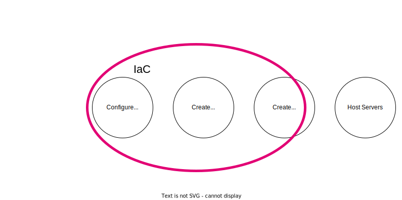

# Terraform for VMware: Key Takeaways and Lessons from Managing Hundreds of VMs

*Date: 2025-02-16*

Managing a large number of virtual machines can be challenging. As our infrastructure grew, we needed a [better way to handle the complexity](idlc-en.md). That's when we turned to Terraform to help us manage our VMware environment more efficiently. I'm going to cover the use cases for IaC and share:

- The technology stack used and the evolution of the infrastructure management practices.
- Lessons learned from using Terraform to manage hundreds of VMs in VMware landscape.

The goal is to provide practical insights and tips for anyone looking to improve their VM management with Terraform for VMware.

## IaC

### IaC: use cases


I'm going to cover some very basic scenarios of VMs lifecycle:

1. Create VM templates
2. Create VMs
3. Configure VMs

### IaC tech stack


There are many technologies available for different levels of infrastructure management. As DevOps engineers, we had to make specific choices. In our case:

1. **Create VM templates**: Ansible + Packer
2. **Create VMs**: Terraform
3. **Configure VMs**: Ansible

Let us take a look at specific parts and the whole solution.

### Packer. How does it work?


1. There is a git repository containing:
    - Packer configuration
    - Anaconda configuration
    - Ansible playbooks and collections
2. There is a Jenkins job that weekly runs the Packer build.


Behind the Packer build command:

1. Create an empty VM:
    - Mount ISO
    - Share kickstart file
    - Type boot command to use the kickstart file
2. Anaconda (Rocky installer) is started:
    - Disk layout is configured
    - User for Ansible is created
    - Network is configured
    - SSH is configured
3. VM is booted and reachable
4. Run Ansible playbook
5. Export the VM template to a content library

### Terraform. How does it work?


Terraform is a stateful application with some important concepts:

1. **Provider API Connection**: Terraform connects to provider APIs and manages state above it.
2. **State Management**: Terraform tracks resources and ensures:
    - **Idempotence**: Only updates resources that have changed.
    - **Dependency Management**: Handles dependencies correctly.

### Ansible. How does it work?


Ansible automates the configuration of VMs through the following steps:

1. **Inventory**: identifies the target hosts from the inventory file.
2. **Playbook**: reads and parses the playbook to determine the tasks to be executed.
3. **Generate**: generates the necessary executable code based on the playbook.
4. **Copy**: securely copies the generated code to the target hosts.
5. **Execute**: executes the copied Python code on the target hosts to apply the configurations.

### Glue it together


Everything is stored in git. There are some linked processes:

1. **Packer**: Create a VM template via Packer, apply base configuration via Ansible, and save it to the VMware content library.
2. **Terraform**: Create a new VM from the VM template in the content library and assign tags.
3. **Ansible**: Split VMs into groups according to the VMware tags and customize the VMs.

## History


The beginning of the story is described in the [Ansible: CoreOS to CentOS, 18 months long journey](coreos2centos-en.md). In short, it describes the migration from a custom configuration management solution to Ansible + Packer for managing the environment. As part of that journey, I created the [vmware_content_deploy_ovf_template](https://github.com/ansible-collections/community.vmware/blob/main/plugins/modules/vmware_content_deploy_ovf_template.py) Ansible module as part of the VMware collection.



But we had the problem of having multiple sources of truth about VM configurations: VMware and the git repository. The goal was to have only one source of truth to make IaC consistent.

## Terraform for VMware

I'm going to share some chronological lessons learned from implementing Terraform.

### Know-how: Race conditions during terraform apply

**Steps to reproduce:**

1. Person A changes something & runs terraform apply
2. Person B changes something & runs terraform apply

**Result:** infrastructure is not in consistent state
**How to avoid:** use remote state

### Problems: Use wrong hostname for customizations

**Steps to reproduce:**

1. You create VM via ctrl+C & ctrl+V
2. You change the resource name, but keep hostname for customization
3. Vmware creates new VMs and set another VM hostname

**Result:** original VM is not reachable
**How to avoid:** double check the changes

### Problems: Lost VM during increasing RAM

**Steps to reproduce:**

1. You create VM, the creation process returned, but the VM is created on VMware
2. The VM is marked as a tainted in terraform state
3. You change the RAM
4. Terraform delete tainted VM & create a new one instead

```
  ### module.InfraServices.vsphere_virtual_machine.example-com is tainted, so must be replaced
-/+ resource "vsphere_virtual_machine" "example-com" {
      - boot_delay                              = 0 -> null
      - boot_retry_enabled                      = false -> null
      ~ change_version                          = "2023-07-28T11:41:47.016148Z" -> (known after apply)
```

**Result:** data are lost, but nobody has used the VM
**How to avoid:** don't keep VMs in bad state. fix it or recreate

### Know-how: Terraform & vmware use different storages

**Steps to reproduce:**

1. You create VM and set `datastore_id`
2. You configure multiple datastores and policy to move across them(DRS)
3. Vmware moves VM to another datastore
4. You run terraform & it wants to move it back

```hcl
  ~ resource "vsphere_virtual_machine" "worker23" {
      ~ datastore_id                            = "datastore-2032" -> "datastore-88"
        id                                      = "423845e7-xxxx-xxxx-xxxx-77240ff97399"
        name                                    = "worker23"
```

**Result:** unneeded changes on Vmware
**How to avoid:** use `datastore_cluster_id`

### Know-how: Changes lead to performance degradation

**Steps to reproduce:**

1. You create VMs and set `datastore_id`
2. You change `datastore_id` to `datastore_cluster_id`
3. Run terraform apply
4. Terraform applies all changes at the same time

**Result:** multiple disks can be moved across storages
**How to avoid:** do not do many changes at the same time

### Problems: Failed to use datastore_cluster_id

**Steps to reproduce:**

1. You create VM and set `datastore_cluster_id`
2. You run terraform & it fails

```hcl
│ Error: Cannot use datastore_cluster_id with Content Library source
│
│   with module.TrainingsAndDemo.vsphere_virtual_machine.example-06,
│   on modules/TrainingsAndDemo/example-06.example.local.tf line 2, in resource "vsphere_virtual_machine" "example-06":
│    2: resource "vsphere_virtual_machine" "example-06" {
```

**Result:** VM is not created
**How to avoid:**

1. You create VM, set `datastore_id` & run terraform
2. You change `datastore_id` -> `datastore_cluster_id` & run terraform

### Know-how: Run terraform twice to create a VM

**Steps to reproduce:**

1. You create VM, set `datastore_id` & run terraform
2. You change `datastore_id` -> `datastore_cluster_id` & run terraform
**Result:** VM is created, but there are too many actions. it's not bug but API [feature](https://github.com/hashicorp/terraform-provider-vsphere/issues/1087)

**How to avoid:**

1. You create a storage policy & add all storage to that policy
2. You create VM and set `storage_policy_id` & run terraform

```hcl
data "vsphere_storage_policy" "storage_cluster_01" { name = "Storage Cluster 01" }
resource "vsphere_virtual_machine" "customnagpr" {
  name                       = "customnagpr"
  storage_policy_id          = var.storage_policy_id
```

### Problems: Sometimes VM creation is failed

**Steps to reproduce:**

1. You create VM in InfraServices pool & wait till the next backup
2. You run terraform & get unneeded changes

```
│ Error: error detaching tags to object ID "vm-108158": POST <https://vcenter01.example.local/rest/com/vmware/cis/tagging/tag-association/id:urn:vmomi:InventoryServiceTag:2c12366a-xxxx-xxxx-xxxx-59ab8e157645:GLOBAL?~action=detach:> 404 Not Found
│
│   with module.ExamplePersonal.vsphere_virtual_machine.ld-example,
│   on modules/ExamplePersonal/ld-example.example.local.tf line 2, in resource "vsphere_virtual_machine" "ld-example":
│    2: resource "vsphere_virtual_machine" "ld-example" {
```

**Result:** terraform exits with non zero code
**How to avoid:** there are no ideas, run it twice

### Know-how: Terraform & backups are conflicting

**Steps to reproduce:**

1. You configure backups. It uses custom attributes.
2. You create VM

```
  ~ resource "vsphere_virtual_machine" "example-com" {
      ~ custom_attributes                       = {
          - "304" = "OK" -> null
          - "305" = "31-07-2023 02:31:26" -> null
```

**Result:** There is unneeded change
**How to avoid:** add into the VM config

```hcl
lifecycle {
    ignore_changes = [
      custom_attributes["304"],
      custom_attributes["305"]
```

### Know-how: Move VM to another pool = recreate it

**Steps to reproduce:**

1. You create a VMware module for each pool
2. You move file to another module & run terraform
3. Terraform recreates the VM

**Result:** The VM is recreated
**How to avoid:** add temporary code for migration

```hcl
moved {
  from = module.ExamplePersonal.vsphere_virtual_machine.ld-example
  to   = module.AnoverPersonal.vsphere_virtual_machine.ld-example
}
```

**Links:** https://developer.hashicorp.com/terraform/tutorials/configuration-language/move-config

### Problems: Move VM to another pool = restart network

**Steps to reproduce:**

1. You create a dedicated network for each pool
2. You move a VM to another pool

**Result:** The VM is not reachable by DNS name & you must restart network to fix it
**How to avoid:** there is no solution

### Know-how: Delete the VM TF file = delete the VM

**Steps to reproduce:**

1. You remove the VM TF file & run terraform
2. Terraform deleted the VM

**Result:** The VM is deleted
**How to avoid:**

1. Double check the changes
2. Set [prevent_destroy](https://developer.hashicorp.com/terraform/language/meta-arguments/lifecycle#prevent_destroy)

```hcl
...
    prevent_destroy = true
...
```

### Know-how: create VM with 2 disks

**Steps to reproduce:**

1. Assign 2 disks & run `terraform apply`

```
Planning failed. Terraform encountered an error while generating this plan.
│ Error: disk: duplicate SCSI unit_number 0
│
│   with module.InfraServices.vsphere_virtual_machine.commondata,
│   on modules/InfraServices/commondata.example.local.tf line 2, in resource "vsphere_virtual_machine" "commondata":
│    2: resource "vsphere_virtual_machine" "commondata" {
```

**How to avoid:** set `unit_number`

```hcl
  disk {
    label            = "disk1"
    size             = 120
    controller_type  = "scsi"
    thin_provisioned = true
    unit_number      = 1
```

### Know-how: Import existing VMs

1. Create a TF file with the VM description & import it

```bash
terraform import module.ExampleGuild.vsphere_virtual_machine.ans-jenkins01 /My\\ Datacenter/vm/ExampleGuild/ans-jenkins01

```

2. Run Terraform apply

```
      - enable_logging                          = true -> null
      ~ imported                                = true -> false
      + storage_policy_id                       = "eaf0b1ab-xxxx-xxxx-xxxx-348473a5727b"
      - sync_time_with_host                     = true -> null
      - cdrom {
          - client_device  = false -> null
          - device_address = "ide:0:0" -> null
          - key            = 3000 -> null
        }
      ~ disk {
          ~ keep_on_remove   = true -> false
```

**TIP:** locator format: `<DC NAME>/vm/<Folder>/<VM Name>`

### Know-how: Import VMs without reboot

**Steps to reproduce:**

1. You have a VM created not via Terraform.
2. You create a TF file and import the VM.

**Result:** The VM is rebooted.

**How to avoid:** Review the Terraform output and align the VM parameters accordingly.


```diff
diff -C0 created-by-terraform.example.local.tf created-manually.example.local.tf
...
*** 9,10 ****
-   sync_time_with_host        = true
-   enable_logging             = true
 8
-
*** 31,32 ****
!   cdrom {
!     client_device = false
 27,35
-
!   clone {
!     template_uuid = data.vsphere_content_library_item.packer_rocky8.id
!     customize {
!       linux_options {
!         host_name = "jenkins-dockerbuild-02"
!         domain    = var.domain
!       }
!       network_interface {}
!     }
***************
*** 34,38 ****
-
-   cdrom {
-     client_device = false
-   }
```

### Know-how: vApp Containers

1. Describe the container & the VM

```hcl
data "vsphere_folder" "folder" { path = "/My Datacenter/vm/example" }
resource "vsphere_vapp_container" "VAPP_demo" {
  name                    = "VAPP-demo"
  parent_folder_id        = data.vsphere_folder.folder.id
```

2. Import the existing container

```bash
terraform import module.Imagemaster.vsphere_vapp_container.VAPP_demo /My\ Datacenter/host/My\ Cluster\ 01/Resources/Example/VAPP-demo
```

3. Describe a vm & run terraform apply

```hcl
resource "vsphere_virtual_machine" "fdemo-docker" {
  name                       = "demo-docker"
  resource_pool_id           = vsphere_vapp_container.VAPP_demo.id
```

### Know-how: sync changes from VMware

**Steps to reproduce:**

1. Change RAM settings in VMware
2. Run terraform

```
  ### module.ExamplePersonal.vsphere_virtual_machine.ld-example will be updated in-place
  ~ resource "vsphere_virtual_machine" "ld-example" {
      - memory_reservation                      = 16384 -> null
      ~ num_cores_per_socket                    = 2 -> 1
      ~ num_cpus                                = 6 -> 2
```

**Result:** Terraform wants to revert it
**How to avoid:** Do changes via terraform or sync them

```hcl
  num_cpus             = 6
  num_cores_per_socket = 2
  memory_reservation   = 16384
```

### Problems: GPU settings & host affinity are not detected

**Steps to reproduce:**

1. add a GPU & set Host/Rule affinity
2. Run `terraform apply`

```
  ### module.ExamplePersonal.vsphere_virtual_machine.ld-example will be updated in-place
  ~ resource "vsphere_virtual_machine" "ld-example" {
      - memory_reservation                      = 16384 -> null
      ~ num_cores_per_socket                    = 2 -> 1
      ~ num_cpus
```

**Result:** The only RAM changes are detected
**How to avoid:** just added note...

### Problems: Not able to create VM with 2 NICs

**Steps to reproduce:**

1. Create a VM with 2 NICs & run `terraform apply`
2. Get the error

```
│ Error: 400 Bad Request: {"type":"com.vmware.vapi.std.errors.invalid_argument","value":{"error_type":"INVALID_ARGUMENT","messages":[{"args":["network_mappings","com.vmware.vcenter.ovf.library_item.resource_pool_deployment_spec"],"default_message":"Could not convert field 'network_mappings' of structure 'com.vmware.vcenter.ovf.library_item.resource_pool_deployment_spec'","id":"vapi.bindings.typeconverter.fromvalue.struct.field.error"},{"args":[],"default_message":"Element already present in the map.","id":"vapi.bindings.typeconverter.map.duplicate.element"}]}}
```

**Result:** Failed to craete
**How to avoid:** create with 1 NIC & after add the 2nd

### Know-how: bulk tags update

1. You assign single tag to each VM via terraform
2. You want to use multiple tags because of ansible inventory
3. Terraform fails because VMware allows the only one tag
4. You change cardinality to `MULTIPLE`
5. terraform recreates the tag category & reassigns all tags to all VMs

```hcl
resource "vsphere_tag_category" "terraform_managed_category" {
  name        = "terraform_managed_category"
  cardinality = "MULTIPLE"
  description = "Managed by Terraform"
  associable_types = [
    "VirtualMachine",
```

### Know-how: Re-create VM templates from nothing

1. Delete the content library
2. Create an empty content library
3. Keep calm & re-run jenkins jobs to rebuild packer templates
4. Export terraform state `terraform state pull > state.json`
5. Change manually via search & replace:
    - template id for each vm
    - content library id
    - state version
6. Push the sate `terraform state push state.json`
7. Open shampain

### Know-how: Repo structure

It is not ideal because there is a lot of copy-pasting, but it is quite easy to find the specific VM and tune it.

```
├── < FOLDER NAME >.tf
├── connections.tf
├── main.tf
├── modules
│   ├── < FOLDER NAME >
│   │   ├── < VM NAME >.example.local.tf
│   │   ├── _main.tf
│   │   └── _variables.tf
├── outputs.tf
├── README.md
├── remote_state.tf
├── tags.tf
├── variables.tf
└── versions.tf
```

**< FOLDER NAME >** - the same as Network/Folder/Pool names in VMware

### Problems: Add domain_ou support for Windows customization doesn't work

**Steps to reproduce:**

1. Try to create a Windows VM, join it to the domain, and place it into a specific OU.
2. It's not possible because there is no support.

**Result:** The VM must be moved manually to the specific OU.
**How to avoid:** [Create a PR with the required functionality](https://github.com/hashicorp/terraform-provider-vsphere/pull/2181) to the upstream and wait.

### Know-how: ansible dynamic inventory

Create `tags.tf`

```hcl
resource "vsphere_tag_category" "terraform_managed_category" {
  name        = "terraform_managed_category"
  cardinality = "MULTIPLE"
  description = "Managed by Terraform"

  associable_types = [
    "VirtualMachine",
    "Datastore",
    "VirtualApp",
  ]
}


resource "vsphere_tag" "Sandbox" {
  name        = "Sandbox"
  category_id = vsphere_tag_category.terraform_managed_category.id
  description = "Ansible group default_db_postgres. Managed by Terraform"
}
```

create a VM tf file and assign the tags

```hcl
resource "vsphere_virtual_machine" "demo-db-pg" {
  name                       = "demo-db-pg"
  storage_policy_id          = var.storage_policy_id
  resource_pool_id           = vsphere_vapp_container.demo.id
  wait_for_guest_net_timeout = 5
  sync_time_with_host        = true
  enable_logging             = true
  firmware                   = "efi"
  annotation                 = <<-EOT
    !!! Do not edit properties via vcenter via web ui !!!
    Managed by ansible & terraform

    Some important notes

  EOT

  tags = [
    vsphere_tag.Sandbox.id,
  ]
...
```

Install the `community.vmware` collection and create the `hosts.vmware.yml`

```yaml
plugin: vmware_vm_inventory
hostname: vcenter01.example.com
username: xxx
with_tags: True
keyed_groups:
- key: tag_category.terraform_managed_category
  prefix: ""
  separator: ""
hostnames:
  - 'config.name+".example.com"'
properties:
  - 'config.name'
  - 'summary.runtime.powerState'
  - 'guest.guestFamily'
with_nested_properties: true
filters:
  - tag_category.terraform_managed_category is defined
  - "'Sandbox' in tag_category.terraform_managed_category"
  - guest.guestFamily is defined
  - guest.guestFamily == 'linuxGuest'
  - summary.runtime.powerState == 'poweredOn'
resources:
  - datacenter:
    - My Datacenter
    resources:
    - compute_resource:
      - My Cluster 01
```

## Summary

### Known issues

1. Use wrong hostname for customizations makes original VM unreachable
2. The `datastore_cluster_id` is not supported & we must use `storage_policy_id`
3. Sometimes VM creation is failed
4. Move VM to another pool requires restart network
5. Use wrong hostname for customizations makes original VM unreachable
6. The `datastore_cluster_id` is not supported & we must use `storage_policy_id`
7. Sometimes VM creation is failed
8. *Too many code & copy-paste*
9. *Higher entrance level*

### Lessons learned

1. Use remote state
2. It's tricky to catch more than 10 changes at one time
3. With great power comes great responsibility
4. Bulk changes can lead to performance degradation
5. Avoid configuration drift between VMware & terraform
6. Instead of recreating VM you can simply move it
7. Use `prevent_destroy` to avoid VMs deletion
8. Use simple & obvious structure to make entrance level lower
9. Use to ansible dynamic inventory based on tags
10. It's possible to add the missing functionality

### Benefits

1. It's really easy to perform bulk updates
2. Re-create infra from nothing
3. Trackable changes
4. Single source of the truth

### Want to try

1. Terraform pull request automation via [Atlantis](https://www.runatlantis.io/)
2. Build green button in jenkins
3. Windows automation
4. Cloud-init for [setting hostname](https://cloudinit.readthedocs.io/en/latest/reference/modules.html#set-hostname) like [here (sry it's in RU)](https://habr.com/en/articles/574050/)
5. [Tests](200k-iac-en.md) for terraform [like for ansible](ansible-testing-en.md)
