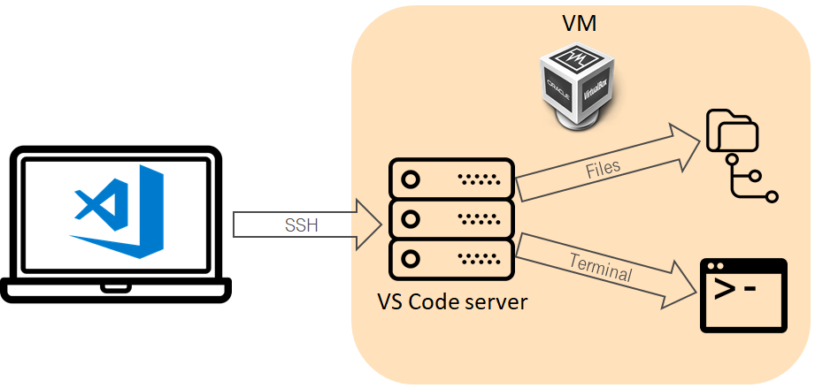

# VScode & Vagrant

*Date: 2021-10-16*



In our case it's the best option.  The key idea is to use local VS code as editor, but execute tests inside CDE. How to configure:

1. Install [VS code](https://code.visualstudio.com/)
2. Install the plugin Remote - SSH
3. Create your ssh key at the laptop and copy the target VM
4. Create [Ansible roles development environment](https://github.com/ultral/ansible_devenv) via Vagrant.
5. Put [vagrant private key](https://github.com/hashicorp/vagrant/blob/master/keys/vagrant) to your home directory
6. Create ssh config for vscode for connection to Vagrant VM

```bash
vscode ssh configuration
Host vagrant
  User vagrant
  Hostname localhost
  Port 2222
  StrictHostKeyChecking no
  IdentityFile ~\.ssh\vagrant
  GlobalKnownHostsFile /dev/null
  UserKnownHostsFile /dev/null
```

## Recommended plugins

* docker
* jinja
* language-ansible
* Ansible
* file Utils
* Git history
* GitLens
* markdownlint
* python
* shellcheck
* jenkinsFile support

## WSL

It’s not the case because too many kludges and limitations. I.e. it’s not possible to run docker & molecule inside WSL (because by nature, WSL is like wine)

## Links

* [keepass & ssh-agent](keepass.md)
* [How to test Ansible and don't go nuts](ansible-testing-en.md)
* [Vagrant Ansible roles development environment](https://github.com/ultral/ansible_devenv)
* [WSL helpers](https://github.com/ultral/sublime_wsl_helpers)
